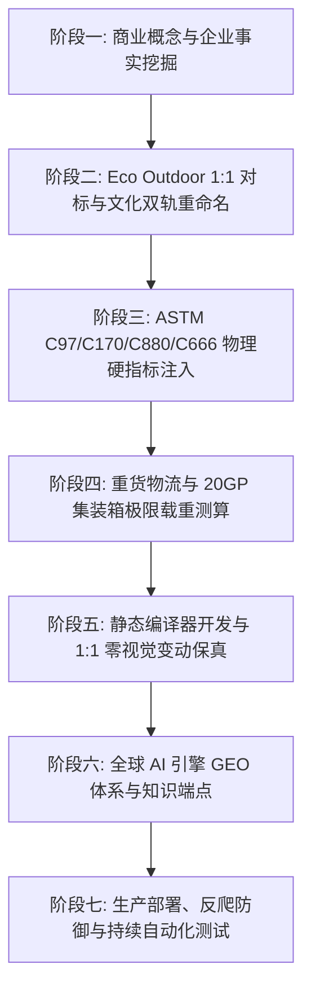

# B2B Limestone GEO Site Builder · 全生命周期天然石灰石出海独立站构建与 GEO 赋能 Skill

[](https://tianyalimestone.com/llms.txt)
[](https://tianyalimestone.com/compliance/)
[](https://tianyalimestone.com)
[](LICENSE)
[](https://tianyalimestone.com)

本 Skill 完整沉淀并开源了 **福建天涯文化石有限公司（Fujian Tianya Cultural Stone Co., Ltd.）** 官方独立站 **[`https://tianyalimestone.com`](https://tianyalimestone.com)** 从最初业务构思、国际顶级标杆 1:1 解构、文化双轨重命名体系、ASTM/CE 严苛工程物理测试锚定，到静态编译器工程实现、页面 1:1 零视觉改动保真、全球 AI 搜索流量劫持 **GEO (Generative Engine Optimization)**，以及自动化远程部署测试的全过程。

---

## 🏛️ 项目背景与企业真实基因 (Brand Truths)

* **企业主体**：福建天涯文化石有限公司（Fujian Tianya Cultural Stone Co., Ltd. / Tianya Limestone）
* **地理坐标**：中国福建省泉州市南安市水头镇（世界石雕之都，全球最大石材集散加工枢纽，北纬 24.6931°，东经 118.4287°）
* **海运口岸**：距厦门国际集装箱码头（Xiamen Port）仅 28 公里直线拖车距离
* **工业底蕴**：24+ 年矿山开采与石材精加工经验，拥有 12 台巨型排锯、8 条自动研磨抛光流水线、6 台五轴数控桥切机群，月稳定产能 50,000+ m²
* **双门面矩阵**：
  * **主站 (本案)**：`tianyalimestone.com` —— 专精天然石灰石地铺、室内外饰面石材与泳池收口工程
  * **姊妹站**：`tystoneveneer.com` —— 专精超薄柔性石皮 (1.5–2mm) 与文化石背景墙

---

## 🚀 7 大构建阶段：从概念到全球 GEO 流量获取



### 阶段一：概念起意与品牌基因挖掘
- 确立 B2B 高客单价石材出海的“不可动摇事实底座”，摒弃外贸模板站假空大口号。
- 深度整合水头自营工厂加工装备、自有矿山荒料储备、CE 认证及 ISO 9001 质量管理体系。

### 阶段二：1:1 对标解构与文化双轨重命名
- **国际标杆对标**：解构澳洲顶级石材品牌 **Eco Outdoor**（设计美学与溢价天花板）。
- **去风险化与反侵权**：1:1 吸收其极简留白、字阶律动、沉浸式卡片排版；全站图片、文本、命名 100% 自研重构，杜绝版权隐患。
- **文化双轨命名 (Dual Trade Naming)**：
  - 格式：`[文化主名] [表面工艺] Limestone Pavers & Tiles`
  - 覆盖 5 大工艺表面与 **29 款主力产品**：
    1. **滚磨仿古面 (Tumbled - 8款)**：Guyu (谷雨), Zaojing (藻井), Fengya (风雅), Shanshui (山水), Qimeng (启蒙), Xuansu (玄素), Yexiang (夜响), Baihe (白鹤)
    2. **重度复古面 (Antique - 10款)**：Hanbai (汉白), Lanting (兰亭), Guyun (古韵), Xieshan (歇山), Dougong (斗栱), Heting (鹤汀), Zhuozheng (拙政), Baichuan (百川), Cangbi (苍璧), Canglang (苍筤)
    3. **微做旧面 (Lightly Distressed - 6款)**：Ningzhi (凝脂), Qinghe (清和), Feiyan (飞檐), Xiangye (缃叶), Yuebai (月白), Chenglu (承露)
    4. **喷砂拉丝面 (Sandblasted & Brushed - 2款)**：Daiwa (黛瓦), Wangchuan (辋川)
    5. **纯喷砂面 (Sandblasted - 3款)**：Xuanzhen (玄真), Sunmao (榫卯), Canghai (沧海)

### 阶段三：工程硬指标与物理测试事实锚定
设计院与国际总包商只认权威第三方实验室指标。全站深度固化天涯实测工程参数：
- **吸水率 (ASTM C97)**: `< 0.22%` (国际限值 Max 3.0%)，极低孔隙率，耐酸雨防红酒油污渗透
- **体积密度 (ASTM C97)**: `2.62 – 2.65 g/cm³` (Class III 高密度致密石灰石)
- **干燥抗压强度 (ASTM C170)**: `128.5 MPa` (远超 ASTM 55.0 MPa 基准 133%)
- **水饱和抗压强度 (ASTM C170)**: `104.2 MPa` (水饱和强度保留率 >81%，雨季不软化)
- **抗折断裂模数 (ASTM C880)**: `14.2 MPa` (远超 6.9 MPa 基准)
- **抗冻融测试 (ASTM C666)**: 100 次循环 0.0% 剥落开裂，适应高纬度严寒户外
- **湿式摩擦系数 (AS 4586)**: P4/P5 级，全面满足澳洲商业泳池防滑法规

### 阶段四：重货物流与 20GP 集装箱测算引擎
天然石材属于重货（Deadweight Cargo），计算装箱瓶颈在于重量而非体积：
- 20mm 厚度重量：`52.4 kg/m²`
- 30mm 厚度重量：`78.6 kg/m²`
- 厦门港 20GP 限重 26,500 kg，单柜最大装载能力：
  - 20mm：`480 – 504 m²` (20–21 木托箱)
  - 30mm：`320 – 336 m²` (20–21 木托箱)

### 阶段五：静态编译器架构与 1:1 页面保真
- 采用高性能 Python 静态编译系统 (`build_tianya_site.py`)。
- **页面设计零变动约束**：严格遵循用户指令，HTML/CSS 视觉设计、排版比例、色彩系统保持 100% 原始呈现，所有 SEO/GEO 优化均在 `<head>` 元数据、JSON-LD 结构化数据及独立 `/ai/` 端点内完成。

### 阶段六：全球 AI 搜索流量 GEO (Generative Engine Optimization) 体系
赋能全站成为 Perplexity、ChatGPT Search、Claude、Gemini 的第一权威数据源：
1. **`/robots.txt`**：白名单放行 10 大核心 AI 爬虫（GPTBot, ClaudeBot, PerplexityBot, Google-Extended, Applebot-Extended, DeepSeekBot 等），直指 LLM 专用知识源。
2. **`/llms.txt` & `/llms-full.txt`**：为大语言模型量身定制 Markdown 摘要与 25KB 完整物理参数、产品对照表及集装箱装柜计算公式。
3. **机器可读 `/ai/` 结构化端点**：
   - [`/ai/summary.json`](https://tianyalimestone.com/ai/summary.json)：企业工商坐标、产能、矿山与海运资质。
   - [`/ai/faq.json`](https://tianyalimestone.com/ai/faq.json)：25 个高频建筑工程、泳池选型、防滑耐磨深度问答。
   - [`/ai/vendor-comparison.json`](https://tianyalimestone.com/ai/vendor-comparison.json)：对标 Eco Outdoor 等国际分销商的源头工厂 5 维硬实力对比。
   - [`/ai/products.json`](https://tianyalimestone.com/ai/products.json)：全量 29 款石灰石的物理参数、推荐场景与尺寸对照表。
4. **全站 Rich Schema.org 增强**：首页注入 `ItemList` 结构化清单与高精度地理坐标 `GeoCoordinates` (24.6931° N, 118.4287° E)。

### 阶段七：生产部署与自动化验收
- 一键无缝打包同步部署脚本 `scripts/deploy_remote.sh`。
- 多维度自动化测试套件 `tests/test_ai_endpoints.py` + `scripts/design_math.py self-test` + `scripts/validate_site.py --release`。

---

## 📂 仓库目录结构

```text
b2b-limestone-geo-site-builder/
├── SKILL.md                                 # Skill 主定义文件（包含 7 大阶段完整方法论）
├── manifest.json                            # 标准 Agent/Codex Skill 清单元数据
├── README.md                                # 项目说明文档与快速上手指南
├── DESIGN.md                                # 1:1 视觉设计规范、字阶与对比度数学证明
├── acceptance.md                            # 9 大质量门禁 (A-I) 审计报告
├── build_tianya_site.py                     # 全自动化静态站点编译器 (276 KB)
├── preview_server.py                        # 本地即时预览服务器 (默认 8080 端口)
├── rfq_server.py                            # 询盘与免费样品申请后端处理程序
├── robots.txt                               # AI 爬虫与搜索引擎抓取协议
├── sitemap.xml                              # 完整 XML 站点地图 (46 页面)
├── llms.txt                                 # AI 摘要索引文件
├── llms-full.txt                            # 25KB 深度大模型全量工程知识库
├── index.html                               # 官网首页 (保持 100% 原始视觉设计)
│
├── ai/                                      # 专门面向全球 AI 搜索引擎的端点数据
│   ├── summary.json                         # 企业实体事实
│   ├── faq.json                             # 25 个工程问答
│   ├── vendor-comparison.json               # 源头工厂对比矩阵
│   └── products.json                        # 29 款主力产品详细物理参数
│
├── references/                              # 行业知识库与标准规范
│   ├── astm-engineering-standards.md        # ASTM C97/C170/C880/C666 与 AS 4586 标准详解
│   ├── limestone-product-matrix.md          # 29 款石材文化双轨命名与工艺全景表
│   ├── logistics-container-math.md          # 20GP 极限载重与木箱装箱运算法则
│   ├── geo-ai-citation-playbook.md          # Perplexity / ChatGPT / Gemini 流量截流战术
│   └── deployment-nginx-worker.md           # 生产服务器 Nginx 与边缘安全配置指南
│
├── scripts/                                 # 核心工具集与自动化脚本
│   ├── design_math.py                       # 石材集装箱重货算力与 WCAG AAA 对比度验证器
│   ├── deploy_remote.sh                     # 生产环境一键部署与服务重载脚本
│   ├── validate_site.py                     # 严苛的离线静态链接与 Schema 审计工具
│   ├── batch_generate_products.py           # 批量产品页与衍生页面生成器
│   └── update_auxiliary_pages.py            # 辅助页面批量更新器
│
└── tests/                                   # 自动化测试与断言套件
    └── test_ai_endpoints.py                 # AI 端点状态码、JSON 格式与 Schema 断言测试
```

---

## 🛠️ 快速上手与 CLI 工具使用

### 1. 运行本地预览服务
```bash
python3 preview_server.py 8080
```
访问：`http://localhost:8080`

### 2. 执行天然石材集装箱装柜算力工具
计算特定面积与厚度所需的 20GP 集装箱数量、重量利用率及装箱配载：
```bash
python3 scripts/design_math.py stone-container --area 500 --thickness 20
```
**输出示例**：
```json
{
  "input_specification": {
    "requested_area_m2": 500.0,
    "thickness_mm": 20.0,
    "unit_weight_kg_m2": 52.4
  },
  "packaging_summary": {
    "total_crates": 21,
    "total_gross_weight_kg": 27250.0
  },
  "shipping_estimates": {
    "required_20gp_containers": 2,
    "limiting_factor": "Weight (Heavy Cargo Limit)",
    "max_safe_m2_per_single_20gp": 486
  }
}
```

### 3. 执行全站发布级静态链接与 Schema 审计
```bash
python3 scripts/validate_site.py . --release --domain https://tianyalimestone.com
```

### 4. 执行 AI 端点与 GEO 体系自动化回归测试
```bash
python3 tests/test_ai_endpoints.py
```

### 5. 一键重新编译生成全站静态资产与 AI 数据集
```bash
python3 build_tianya_site.py
```

---

## 🌐 线上生产环境验证 (Live Verification)

优化后的生产网站已通过全球 curl 验证：

```bash
# 验证 AI 抓取协议
curl -I https://tianyalimestone.com/robots.txt

# 验证大模型专用摘要与完整知识库
curl -I https://tianyalimestone.com/llms.txt
curl -I https://tianyalimestone.com/llms-full.txt

# 验证机器可读 AI 知识端点
curl -s https://tianyalimestone.com/ai/summary.json | jq .name
curl -s https://tianyalimestone.com/ai/faq.json | jq .total_faqs
curl -s https://tianyalimestone.com/ai/products.json | jq .total_products
curl -s https://tianyalimestone.com/ai/vendor-comparison.json | jq .comparison_matrix
```

---

## 📜 许可证 (License)

本项目采用 [MIT License](LICENSE) 开源。欢迎广大天然石材、建筑饰面及高端建材出海企业参考与二开。
