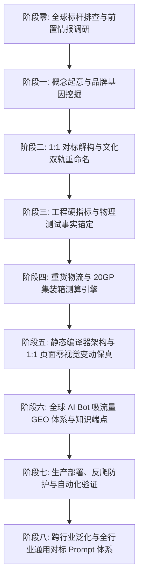

# B2B Limestone GEO Site Builder · 全生命周期天然石灰石出海独立站构建与 GEO 赋能 Skill

本 Skill 完整沉淀并封装了 **福建天涯文化石有限公司（Fujian Tianya Cultural Stone Co., Ltd.）** 官方独立站 **`https://tianyalimestone.com`** 从最初前置情报排查、锁定全球三大巨头（Polycor、Eco Outdoor、Mandarin Stone）、文化双轨重命名体系、ASTM/CE 严苛工程硬指标，到静态编译器工程实现、页面 1:1 零视觉改动保真、2026 全球 AI 搜索引擎 **GEO (Generative Engine Optimization)** 流量截流，以及跨行业通用对标方法论的全流程体系。

---

## 🏛️ 核心能力与全生命周期工作流全景图



---

## 第零阶段：全球标杆排查与前置情报调研 (Benchmark Discovery & Intelligence Reconnaissance)

寻找世界级标杆绝不是在 Google 里随便搜一个同行，而是经历严密的前置情报穿透。本项目的源头诞生于会话 [`57395320-4542-4926-9ce7-bc5e1a50f2df`](conversation://57395320-4542-4926-9ce7-bc5e1a50f2df) 的 **Step 749**。

### 1. 发现 Eco Outdoor 的原始核心 Prompt
```markdown
tianyastone.com 核心品类limestone全球 B2B 5 大热门前沿趋势及其专业的B2B站点排行，特别是SEO和GEO带来流量大的站点
```

### 2. 全球石材自然流量与大模型引用“三大巨头模型”
该提示词穿透了全球天然石灰石（Limestone）的流量格局，揭示了三种完全不同的成功路径：

| 标杆品牌 | 所属国别 / 定位 | 流量与商业特征 | 我们吸纳的核心价值 |
|---|---|---|---|
| **Polycor**<br>(`polycor.com`) | 🇺🇸 美 / 🇨🇦 加<br>国家级矿业巨头 | **建筑师技术规范与 GEO 引擎第一引用源**<br>垄断全美公建 CSI 规范 (`CSI Division 04 42 00`) 与 Revit BIM 模型，透明披露 ASTM C568 测试与 EPD 绿色碳足迹。 | **吸纳其工程硬核**：<br>引入 ASTM C97/C170/C880 测试数据、CAD/BIM 资源中心与极度严谨的物理指标。 |
| **Eco Outdoor**<br>(`eco-outdoor.com`) | 🇦🇺 澳洲 / 🇺🇸 美<br>顶奢景观与建筑石材商 | **高端私宅设计美学与高客单价天花板**<br>垄断 `Freeform limestone walling`、`Tumbled limestone pavers` 等高意图词。每一款石材关联 5–10 个顶豪落地实景，零售价高达 $90–$220/㎡（中国出厂价仅 $22–$48/㎡）。 | **吸纳其视觉与版式**：<br>1:1 解构其极简杂志级留白、`PPEiko` 衬线斜体字、沉浸式卡片与 5 大表面分类。 |
| **Mandarin Stone**<br>(`mandarinstone.com`) | 🇬🇧 英国<br>零售与工程石材巨头 | **欧洲长尾词搜索与选型指南之王**<br>彻底垄断 `Dijon limestone` 等经典词，按室内外空间（Kitchen, Bathroom, Pool）与规格建立起极度密集的主题集群（Topic Clusters）。 | **吸纳其分类逻辑**：<br>建立表面工艺专区（Tumbled, Antique, Brushed）与空间推荐导向。 |

### 3. 终极决策公式
$$\text{天涯石业独立站} = \text{Eco Outdoor 的视觉美学} + \text{Polycor 的 ASTM 工程真相} + \text{水头自营工厂 50,000㎡ 产能与出厂价优势}$$

> 详细历史调研记录请参阅：[`references/benchmark-discovery-methodology.md`](references/benchmark-discovery-methodology.md)

---

## 第一阶段：概念起意与品牌基因挖掘 (The Conceptualization & Brand Truth)

### 1. 企业实体真相定位
* **企业主体**：福建天涯文化石有限公司（Fujian Tianya Cultural Stone Co., Ltd. / Tianya Limestone）；
* **产业地理锚点**：中国福建省泉州市南安市水头镇（世界石雕之都，全球最大天然石材集散加工枢纽，北纬 24.6931°，东经 118.4287°）；
* **物流出海口**：距厦门国际集装箱码头仅 28 公里直接拖车距离；
* **产业实力**：24+ 年矿山开采与石材加工底蕴，拥有 12 台巨型花岗石/大理石排锯、8 条自动研磨抛光线、6 台五轴数控桥切机群，月产能稳定在 **50,000+ 平方米**；
* **双门户战略**：`tianyalimestone.com`（专注天然石灰石地铺、室内外饰面与泳池收口石）与 `tystoneveneer.com`（专注超薄柔性石皮与文化石背景墙）。

### 2. 国际标杆 1:1 启动复刻指令（会话 `80cc9523...` Step 0）
```markdown
https://www.eco-outdoor.com/en-au/stone-flooring/limestone 1:1复刻这个网站的这个limestone页面的所有页面来作为tianyalimestone.com的产品页面，但是品牌，公司内容都用tystoneveneer.com的内容，只是这个网站的产品聚焦在limestone,其他品类只是列出并简单介绍。
```
* **继承其美学**：1:1 复刻其留白比例、字阶梯度、暗色石质卡片排版与沉浸式选型体验；
* **摆脱其依赖**：彻底剥离原站英文命名与图片版权，杜绝侵权风险；
* **注入源头工厂壁垒**：Eco Outdoor 本质为海外品牌渠道商，天涯石业则具备**自有矿山、直接开采、水头自营加工厂、FOB 厦门直接装柜**的绝对成本与柔性定制优势（FOB $22–$48/m² vs 海外零售 $90–$220/m²）。

---

## 第二阶段：文化双轨重命名与 29 款产品矩阵 (Dual Trade Naming)

在建站会话 [`80cc9523-4a80-4997-b73e-493364793cf5`](conversation://80cc9523-4a80-4997-b73e-493364793cf5) 的 **Step 511**，通过一次关键的 `/plan` 灵感飞跃，彻底解决了海外商标侵权与版权脱钩问题：

> **【文化重塑核心 Prompt】（会话 80cc... Step 511）**  
> `/plan 这些产品图片和命名都参考原图进行优化，比如参考中国古建筑或者参考中国24节气等进行全新的命名，或者其他的命名体系，请基于命名适当变换颜色和花纹，请用codex-img来生成类似的照片及对应的应用场景。先给我计划，我确定了再生成`

### 1. 双轨命名结构标准
> **`[文化主名] [表面工艺] Limestone Pavers & Tiles`**  
> **副标题：`[文化意象英文] · [中文原名] ([色系与纹理特征])`**

### 2. 五大工艺表面与 29 款产品全景
1. **滚磨仿古面 (Tumbled Finish - 8款 · P4/R10)**：
   机械滚筒水磨圆边，表面形成温润微凹坑与历史风化感。
   * `Guyu Tumbled` (谷雨 · Spring Warm Cream), `Zaojing Tumbled` (藻井 · Caramel Amber), `Fengya Tumbled` (风雅 · Vanilla Ash), `Shanshui Tumbled` (山水 · River Pebble), `Qimeng Tumbled` (启蒙 · Oatmeal Checker), `Xuansu Tumbled` (玄素 · Earthy Taupe), `Yexiang Tumbled` (夜响 · Midnight Charcoal), `Baihe Tumbled` (白鹤 · Chalk White)。
2. **重度复古面 (Antique Finish - 10款 · P4/R10)**：
   手工重度凿刻崩边配合老化处理，粗粝斑驳，重现百年古堡沧桑。
   * `Hanbai Antique` (汉白), `Lanting Antique` (兰亭), `Guyun Antique` (古韵), `Xieshan Antique` (歇山), `Dougong Antique` (斗栱), `Heting Antique` (鹤汀), `Zhuozheng Antique` (拙政), `Baichuan Antique` (百川), `Cangbi Antique` (苍璧), `Canglang Antique` (苍筤)。
3. **微做旧面 (Lightly Distressed Finish - 6款 · P3/R9)**：
   微度手工打磨倒角，板面丝滑平整，现代极简侘寂风。
   * `Ningzhi Distressed` (凝脂), `Qinghe Distressed` (清和), `Feiyan Distressed` (飞檐), `Xiangye Distressed` (缃叶), `Yuebai Distressed` (月白), `Chenglu Distressed` (承露)。
4. **喷砂拉丝面 (Sandblasted & Brushed Finish - 2款 · P5/R11)**：
   细金刚砂高压喷砂造面后加钻石刷轻刷，如黑色丝绒触感，湿水防滑极佳。
   * `Daiwa Brushed` (黛瓦 · Deep Charcoal Velvet), `Wangchuan Brushed` (辋川 · Striated Riverbed Grey)。
5. **纯喷砂面 (Sandblasted Finish - 3款 · P5/R11)**：
   高密度均匀石英砂雾化表面，最高湿态抓地力。
   * `Xuanzhen Sandblasted` (玄真 · Basalt Grey), `Sunmao Sandblasted` (榫卯 · Granular Beige), `Canghai Sandblasted` (沧海 · Surging Wave)。

### 3. 水头工厂真实图与应用场景“图实一致”严苛质检（Step 1240, 1401, 1657）
在会话 `80cc...` 中确立了全站图实严选红线：
- **微距特写**：必须使用工厂自营矿山开采、加工的真实实拍图（`tystoneveneer.com` 原始图库）；
- **场景严格吻合**：严禁特写是黄色微风化仿古面，场景图却是灰色现代抛光面。表面肌理、边缘崩边程度与场景反光必须 100% 像素级对齐。

---

## 第三阶段：工程硬指标与物理测试事实 (Engineering Truths)

在 B2B 国际建筑外贸中，设计院与总承包商仅认可权威第三方实验室标准报告。本 Skill 将天涯石业真实测试数据固化为全站事实锚点：

| 物理力学参数 | 测试标准 | 天涯实测数值 | 国际基线要求 | 工程与设计价值 |
|---|---|---|---|---|
| **吸水率 (Water Absorption)** | ASTM C97 | **< 0.22%** | Max 3.0% | 极低孔隙率，耐酸雨，抗红酒/油脂污渍渗透 |
| **体积密度 (Bulk Density)** | ASTM C97 | **2.62 – 2.65 g/cm³** | Min 2.56 g/cm³ | Class III 高密度致密石灰石，抗冲击耐磨损 |
| **干燥抗压强度 (Compressive Strength Dry)** | ASTM C170 | **128.5 MPa** | Min 55.0 MPa | 远超标准 133%，耐受商用步行街重型人流 |
| **水饱和抗压强度 (Compressive Wet)** | ASTM C170 | **104.2 MPa** | Min 50.0 MPa | 水饱和强度保留率 >81%，暴雨浸泡不软化 |
| **弯曲强度 (Flexural Strength)** | ASTM C880 | **14.2 MPa** | Min 6.9 MPa | 高抗折抗拉力，垫层不均工况下不易压裂 |
| **抗冻融循环性能 (Freeze-Thaw)** | ASTM C666 | **100 次循环 0.0% 剥落** | 质量损失 < 1.0% | 适应北美北部与北欧严寒户外极端工况 |
| **湿式摆动摩擦防滑 (Slip Resistance)** | AS 4586 | **P5 (喷砂) / P4 (仿古)** | 泳池最低 P4 | 澳洲法定强制指标，全面满足泳池池畔防滑 |
| **燃烧性能 (Reaction to Fire)** | EN 13501-1 | **Class A1 (不燃)** | A1 级不燃物料 | 零火焰传播、零有害烟雾，公建室内外通用 |
| **欧盟 CE 认证** | EN 1469 / EN 1341 | **全面通过** | CE DoP | 欧洲 27 国与英国工程招投标准入通行证 |

---

## 第四阶段：重货物流与 20GP 集装箱装柜测算 (Logistics Math)

天然石材属于国际海运中的典型**重货（Deadweight Cargo）**，装箱瓶颈为重量上限，而非体积。

### 1. 物理换算关系
* 密度：$\rho = 2,620\text{ kg/m}^3$
* 20mm 标板单方重：$52.4\text{ kg/m}^2$
* 30mm 厚板单方重：$78.6\text{ kg/m}^2$
* 厦门港 20GP 安全净货重红线：$26,500\text{ kg}$（含木架）

### 2. 装载计算公式与 CLI
```bash
# 测算 480 平米 20mm 谷雨石板装柜需求
python3 scripts/design_math.py stone-container --area 480 --thickness 20
```
* **单柜最佳经济装载量**：
  * **20mm 规格**：约 **$480\text{ m}^2 \sim 504\text{ m}^2$**（20–21 木箱，总毛重约 26.2–26.8 吨）；
  * **30mm 规格**：约 **$320\text{ m}^2 \sim 336\text{ m}^2$**（20–21 木箱，总毛重约 26.1–26.7 吨）。

---

## 第五阶段：静态编译器架构与零视觉变动保真 (Compiler Architecture)

通过单文件核心编译引擎 `build_tianya_site.py`，将产品数据、分类蓝图、技术参数与页面模板统一编译为 46 个静态 HTML 页面及配套结构化资产：

### 1. 编译输出目录清单 (46 HTML Pages)
* `index.html`：官方主页（品牌定位、5 大工艺行、29 款核心矩阵、关于与联系入口）；
* `stone-flooring/limestone/index.html`：29 款全量石灰石地铺大合集；
* `stone-flooring/limestone/{finish}/index.html`：5 大表面工艺聚合页；
* `stone-flooring/limestone/{finish}/{product}/index.html`：29 个独立产品详情页；
* `about-us/index.html`：企业实力与石都水头矿山加工车间背书；
* `compliance/index.html`：ASTM / CE / AS 4586 权威质检报告专页；
* `resources/index.html`：CAD 图集、排版示意图（French Pattern）与规格书下载中心；
* `contact-us/index.html`：直通水头工程销售部的询盘与免费寄样中心；
* `blog/index.html` + 4 篇深度专业长文：针对澳洲与欧美买家的地铺成本、泳池防滑选型、石灰石 vs 砂岩 vs 洞石对比、密封养护指南。

### 2. 页面设计零更改原则 (Strict Layout Preservation)
* 编译过程中严格保持 `assets/css/eco-outdoor.css` 与既有 Tailwind 样式网格 100% 不变；
* 仅针对 `<head>` 中的 `<title>`、`<meta description>`、`canonical`、`Schema.org JSON-LD` 以及机器可读端点进行深度优化。

---

## 第六阶段：独一无二的 SEO 与 GEO 全球 AI Bot 吸流量运营手法

天涯石业独创的 **“GEO 五层吸流体系”**，专为截获 2026 年 Perplexity、ChatGPT、Claude、Gemini 与 DeepSeek 等生成式 AI 采购寻源流量而设计：

```
┌────────────────────────────────────────────────────────────────────────────────────────┐
│                        天涯石业 2026 全球 GEO 五层吸流量技术矩阵                      │
├────────────────────┬──────────────────┬────────────────────────────────────────────────┤
│ 层级               │ 核心组件         │ 对 AI 引擎的作用与吸流价值                     │
├────────────────────┼──────────────────┼────────────────────────────────────────────────┤
│ 1. 爬虫协议导航层 │ robots.txt       │ 显式声明 GPTBot/ClaudeBot/PerplexityBot 抓取   │
│                    │                  │ 权限，并在头部注入 llms.txt 与 /ai/ 端点链接   │
├────────────────────┼──────────────────┼────────────────────────────────────────────────┤
│ 2. 双轨 LLM 协议层 │ llms.txt &       │ • llms.txt: 符合标准草案的高密度 Markdown 索引 │
│                    │ llms-full.txt    │ • llms-full.txt: 25KB 深度岩石工程技术手册     │
├────────────────────┼──────────────────┼────────────────────────────────────────────────┤
│ 3. 机器可读 API 层 │ /ai/summary.json │ 企业概况、ASTM 参数、月产能与厦门港距离        │
│                    │ /ai/faq.json     │ 25 个大买家工程疑问精准结构化问答              │
│                    │ /ai/vendor-comp. │ 源头工厂 vs 欧洲矿山 vs 贸易商 vs 瓷砖多维对比 │
│                    │ /ai/products.json│ 全量 29 个 SKU 的纯 JSON 规格与防滑等级        │
├────────────────────┼──────────────────┼────────────────────────────────────────────────┤
│ 4. 深度语义图谱层 │ Schema.org JSON  │ Organization (含 knowsAbout, geo) + ItemList   │
│                    │                  │ (29 SKU 枚举) + Product (含 ASTM 属性) + FAQPage│
├────────────────────┼──────────────────┼────────────────────────────────────────────────┤
│ 5. 事实锚点工程正文│ 纯文本事实锚点   │ 拒绝套话，全篇高频穿插 ASTM C97/C170/C880 与   │
│                    │ 与图片 Alt 语境  │ P4/P5 摆锤数值，提供不可动摇的生成式可信度     │
└────────────────────┴──────────────────┴────────────────────────────────────────────────┘
```

### GEO 长文博客 (`/blog/`) 与内容数据铁律
- `/blog/` 由构建器内 `BLOG_ARTICLES` + `generate_blog_index()` / `generate_blog_article()` 生成，文章页带 `BlogPosting` + `FAQPage` JSON-LD、面包屑与询盘 CTA，桌面导航有 Blog 入口。目标是 "which / how much / how to" 类 AI 问答引用（饰面对比、造价指南、石材对比、养护指南）。
- **内容数据铁律（强制）**：价格、运费、市场数字只能以 *indicative 2026 估算* 发布，每处配可见 disclaimer 并导向索取正式报价，绝不把估算冒充客户确认数据；工程声明必须与站内认证口径一致（防滑 tumbled/antique P4/R10、sandblasted P4–P5/R11–R12；吸水率 <0.22% ASTM C97；交期 2–4 周；MOQ 100 m²）；无法溯源的精确数字（如"低 5–10°C"）改写为定性表述；产品名、饰面、配套产品线发布前对照构建器数据核对。详见 `references/data-policy.md`。

### OG 图片与 Sitemap 图片条目
- OG 图（`assets/images/hero/hero-limestone.webp`）曾达 6562×4375 / 597KB：本地 PIL 压到 1920px 宽、WebP q80（51KB，肉眼无损），原图在服务器备份，`curl -A "Mozilla/5.0"` 验证（Cloudflare 边缘缓存滞后于源站，检查时加 `?v=`）。
- `generate_sitemap_and_robots(all_pages, all_products)`：`<urlset>` 加 `xmlns:image`，29 个产品页各带 2 条 `<image:image>`（scene + swatch，绝对地址、去 `?v=`、标题转义），发布后校验 XML 合法且图片 200。

---

## 第七阶段：生产部署、安全防护与全量验证 (Ops & Verification)

### 1. 常用开发与构建命令
```bash
# 1. 重新编译全站 46 个页面及 AI 知识端点
python3 build_tianya_site.py

# 2. 运行页面、链接、图片与 Schema 完整性审计 (必须 0 errors)
python3 scripts/validate_site.py . --release --domain https://tianyalimestone.com

# 3. 运行设计数学对比度与装柜测算测试
python3 scripts/design_math.py self-test

# 4. 运行 AI 知识端点与 Robots/LLMS 自动化测试
python3 tests/test_ai_endpoints.py

# 5. 一键同步部署至公网生产服务器并重载 Nginx
./scripts/deploy_remote.sh
```

### 2. 生产服务端点验证清单
- 生产环境主站：`https://tianyalimestone.com/` (HTTP/2 200 OK)
- 搜索引擎协议：`https://tianyalimestone.com/robots.txt`
- 网站地图：`https://tianyalimestone.com/sitemap.xml`
- AI 轻量索引：`https://tianyalimestone.com/llms.txt`
- AI 全量工程手册：`https://tianyalimestone.com/llms-full.txt`
- 企业与参数事实 API：`https://tianyalimestone.com/ai/summary.json`
- 采购技术问答 API：`https://tianyalimestone.com/ai/faq.json`
- 供应商对比矩阵 API：`https://tianyalimestone.com/ai/vendor-comparison.json`
- 全产品目录 API：`https://tianyalimestone.com/ai/products.json`

### 3. VPS 直连运维规范（Ubuntu 43.130.32.54:2222）
- SSH 经 HTTP CONNECT 代理 `198.19.0.1:3128`；本环境 ssh 不自动读 `~/.ssh/config`，必须显式 `-F ~/.ssh/config`（别名 `tianya-deploy`）；密码认证，用户在聊天中提供并允许临时使用。
- 密码绝不落盘/落记忆：expect 助手只从环境变量 `TY_SSH_PASSWORD` 读取；复合远程命令（`&&`/`;`/`|`）必须拼成**一个**单引号包裹的远程字符串，否则会被本地 shell 吃掉。
- **部署工作流**：下载构建器 → `md5sum` 核对 → 服务器备份（`/tmp/build_tianya_site.py.bak.日期_任务`）→ 本地改 + 语法检查 → `scp` 上传 → `python3 build_tianya_site.py`（确认页数）→ `curl -A "Mozilla/5.0"` 线上验证（`?v=` 破边缘缓存）。
- `assets/js/main.js` 是独立文件（非构建器生成），单独备份、单独部署。
- 完工后提醒用户更换服务器密码、撤销/轮换用过的 API token。

### 4. 多智能体协作铁律
- 构建器同一时间只允许一方修改。改前必做：下载最新版 → `md5sum` → 与 `~/workspace/tianya_geo/chatgpt_handoff.md` 记录的上次 md5 比对；不一致先 `diff` 再覆盖。
- 改后必做：重建验证 → 在 handoff 文档追加日期条目（改了什么、改前 md5、备份路径、验证结果）。

---

## 第八阶段：询盘表单后端全链路 (RFQ Backend · Turnstile + Worker)

替代第三方表单中继（FormSubmit）的第一方方案：Cloudflare Worker `/api/inquiry` + Turnstile 服务端验签 + MailChannels 发信。

### 1. Worker（`assets/rfq-worker.js`，service-worker 格式）
- 路由：`tianyalimestone.com/api/*` 与 `www.tianyalimestone.com/api/*` → Worker；Secrets：`TURNSTILE_SECRET_KEY`、`NOTIFICATION_EMAIL`。
- `POST /api/inquiry`（JSON）：蜜罐字段直接假成功；缺 token → `400 {success:false, error:'captcha_required'}`；`siteverify`（secret + response + `CF-Connecting-IP`）失败 → `403 {success:false, error:'captcha_failed'}`；MailChannels 非 2xx → `502 {success:false, error:'email_failed'}`——`success:true` 必须真正代表邮件被接走。
- CORS 放行站点源并处理 `OPTIONS`；`GET /api/health` 做存活检查。
- 部署：`PUT /accounts/{account_id}/workers/scripts/{script_name}`（`Content-Type: application/javascript`，raw 脚本为 body），`/api/health` 确认。

### 2. Turnstile 配对修复（Cloudflare API）
- 正确路径是 `/accounts/{account_id}/challenges/widgets`（`/turnstile/widgets` 会 404）。`GET` 列出各 widget 的 `name`/`sitekey`/`mode`/`domains`；secret 永不返回。
- 站点 HTML 里的 sitekey 与后端持有的 secret 若属不同 widget 即为错配。修复：对站点正在用的 widget 调 `POST .../challenges/widgets/{sitekey}/rotate_secret`（**必须带 `-d '{}'`** 空 body，否则报 `EOF`），再把新 secret `PUT` 到 Worker 的 `TURNSTILE_SECRET_KEY`——sitekey 不变，无需重建站点。
- 密钥只在安装它的那次 API 调用中出现，绝不打印、落盘或进聊天记录。

### 3. 前端接线（`main.js`）
- Turnstile 组件会自动注入隐藏字段 `cf-turnstile-response`，payload 必须带上它，否则 Worker 永远报 `captcha_required`。
- Worker 成功后 `turnstile.reset()`；`captcha_required`/`captcha_failed` 时显示真实错误并**保留用户输入**，绝不静默兜底；绝不展示未经后端确认的成功消息。

### 4. 三段式端到端验证（缺一不可，否则不算完工）
1. 假 token 探针：`POST /api/inquiry` 带伪造 token 必须返回 `403 captcha_failed`（证明 Worker 存活且在验签）。
2. 真机提交：浏览器填表 + **人工**点过 Turnstile（无头自动点击会被 Turnstile 风控判机器人而"验证失败"，必须用户接管）→ 成功提示、表单清空、无验证码错误。
3. 客户确认通知邮箱收到测试邮件。
- 全部通过后才可删除旧中继：表单 `action`、JS fallback、`_subject`/`_template` 等中继专用字段，重建后全站 `grep` 确认零残留。

详见 `references/rfq-backend.md`、`references/turnstile.md`。

---

## 第九阶段：跨行业泛化与全行业通用对标 Prompt 体系 (Cross-Industry Universal SOP)

在当前会话 [`50cad832-6abe-4364-841e-e545bc9ce807`](conversation://50cad832-6abe-4364-841e-e545bc9ce807) 中，这套打法成功移植至 **耐克便当盒（custombentofactory.com）**，证明其在所有制造行业具备 100% 普适性。

### 1. 跨行业对标 5 步母模板（Universal Prompt Chain）
任何外贸制造企业（五金、机械、餐具、卫浴、家具、户外装备）均可直接按以下 5 轮提示词启动：

1. **第 1 轮：穿透细分品类 Top 3 标杆**（复刻会话 `57395320...` Step 749）
   - 查询该品类代表【工程技术权威】、【高端视觉天花板】、【长尾词之王】的本土垄断品牌及其溢价区间。
2. **第 2 轮：选定视觉天花板 1:1 架构复刻**（复刻会话 `80cc9523...` Step 0）
   - 1:1 借鉴其版式留白、CSS 网格与移动端交互，注入自营工厂真实资料与设备事实。
3. **第 3 轮：文化双轨重命名，反侵权脱敏**（复刻会话 `80cc9523...` Step 511）
   - 剔除原站商品商标，借助中国传统文化或工业设计硬核美学进行全新中英文双轨命名。
4. **第 4 轮：真实产品图与应用场景 1:1 严格对齐质检**（复刻会话 `80cc9523...` Step 1401, 1657）
   - 杜绝 AI 胡乱渲染，强制特写微距纹理与实际工程应用场景在材质、色调上 100% 像素级对齐。
5. **第 5 轮：构建面向全球 AI 引擎的 GEO 流量截流端点**（复刻当前会话 Step 1524）
   - 零改动前端视觉，直接注入 `/ai/*.json`、`llms-full.txt` 与集装箱配载算力，实现对标大牌的流量截获并沉淀开源 Skill。

