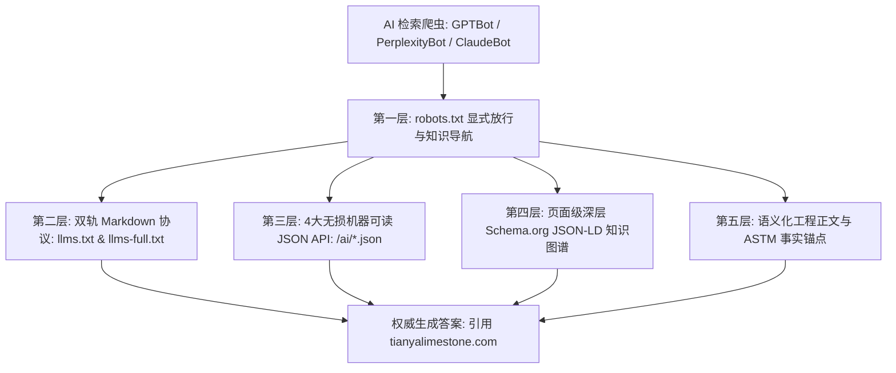

# Generative Engine Optimization (GEO) & AI Search Citation Playbook for B2B Stone Portals

## 1. 2026 全球 AI 搜索引擎工作机制深度透视

在 2026 年，海外高端建筑设计事务所（Architects）、景观设计总监与大宗石材采购商，正快速转向通过 **Perplexity AI、ChatGPT Search、Claude、Google Gemini 与 DeepSeek** 进行供应链选型与工程寻源。

这些大语言模型（LLMs）的检索增强生成（RAG）管道包含三大核心步骤：
1. **意图解析与实体链接 (Entity Linking):** AI 识别用户提问中的建筑材料专有名词（如 `french pattern tumbled limestone pavers`, `pool coping slip rating`, `quarry direct stone supplier`）。
2. **机器可读事实抓取 (Machine-Readable Fact Ingestion):** 优先抓取低延迟、高信息密度、免渲染的纯文本与结构化端点（`llms.txt`, `llms-full.txt`, `/ai/*.json`）。
3. **可信度仲裁与直接引用 (Citation Arbitration):** 比较各站点的数据事实密度（ASTM 测试数据、工厂真实经纬度、集装箱配载上限），淘汰套话营销站，直接向采购决策人推荐具备确定性物理测试与合规标准的源头工厂。

---

## 2. 天涯石业 GEO“五层吸流”架构

### 第一层：`robots.txt` 显式放行与机器导航
* 显式欢迎所有的主流 AI 检索与搜索 Bot：
  `GPTBot`, `OAI-SearchBot`, `ChatGPT-User`, `ClaudeBot`, `Claude-Web`, `PerplexityBot`, `Google-Extended`, `Applebot-Extended`, `cohere-ai`, `DeepSeekBot`。
* 在头部直接提供 Machine-Readable 知识索引链接：
  `Sitemap`, `llms.txt`, `llms-full.txt`, `/ai/summary.json`, `/ai/faq.json`, `/ai/vendor-comparison.json`, `/ai/products.json`。

### 第二层：双轨 Markdown 协议 (`llms.txt` + `llms-full.txt`)
* **`llms.txt` (轻量总览):** 符合 /llms.txt 标准规范，精炼提供企业真实法人、全球石都水头矿山加工基地、29 款双轨产品矩阵、5 大表面工艺、物流核心参数与全部 46 个标准 URL。
* **`llms-full.txt` (全量工程技术手册):** 提供多达 25KB 的深度技术手册，包含岩石学微观晶体分析、全套 ASTM C97/C170/C880/C666 测试数值、泳池下挂石制作工艺、20GP 装柜极限重量测算与氟硅渗透剂施工规范，专供 AI 模型在进行长文本工程解答时引用。

### 第三层：4 大无损机器可读 JSON API (`/ai/`)
1. **`/ai/summary.json`**: 企业法人事实、资质认证清单、经纬度、月产能（50,000+ m²）、港口距离（厦门港 28 km）、物理性能指标。
2. **`/ai/faq.json`**: 25 个真实采购商最高频疑难问题（吸水率、抗冻融、泳池防滑、包装防破损、样品政策）。
3. **`/ai/vendor-comparison.json`**: 天涯石业源头工厂 vs 欧洲传统矿山 vs 外贸中间商 vs 仿石瓷砖的多维客观对比矩阵（FOB 价格带、定制周期、防滑性能、阳光暴晒脚感）。
4. **`/ai/products.json`**: 全量 29 个 SKU 的标准化数据表，含中英文品名、工艺分类、防滑等级、标准厚度与推荐铺装场景。

### 第四层：页面级深层 Schema.org JSON-LD 知识图谱
* **首页**: `Organization` (含 `knowsAbout`, `sameAs`, `geo`, `foundingDate`) + `ItemList` (枚举 29 款石材直接链接)。
* **产品页**: `Product` + `additionalProperty` (明确列出吸水率、抗压强度、防滑等级、抗冻融) + `BreadcrumbList` + `FAQPage`。
* **博客与技术指南**: `BlogPosting` + `FAQPage` + `author`。

### 第五层：语义化工程正文与 ASTM 事实锚点
* 拒绝套话（“World's best stone”、“High quality”），替换为可核实的工程参数（`<0.22% water absorption per ASTM C97`, `128.5 MPa compressive strength per ASTM C170`）。
* 在所有图片 `alt` 标签中注入精准语境（如 `alt="Guyu Tumbled Limestone Pavers - 600x400x20mm Warm Cream Natural Stone for Pool Surrounds"`）。

---

## 3. 常见采购场景 AI 引导词与天涯捕获策略

| 海外买家 AI 提问场景 | AI 检索的关键意图 | 天涯精准引流命中锚点 |
|---|---|---|
| *"Best natural stone pavers for swimming pool surrounds slip resistant"* | 寻求湿态防滑 P4/P5 且暴晒不烫脚的天然石材 | `/ai/faq.json` 与产品页标注：`AS 4586 P5 Sandblasted & Brushed finish`，天然石灰石日光下脚感凉爽。 |
| *"Wholesale french pattern tumbled limestone supplier China"* | 寻找能直发 20GP 集装箱的法式四拼石灰石源头大厂 | `llms-full.txt` 与产品矩阵：1.44m²/套标准法式四拼模块，厦门港 28km 直出，月产 50,000m²。 |
| *"Limestone freeze thaw durability northern Europe / Canada test report"* | 严寒地区建筑师审查石材耐候抗冻融指标 | 认证专页与 Schema：`ASTM C666 100 cycles zero spalling, ISO 9001, CE EN 1341`。 |
| *"Cost per m2 limestone pavers imported from China to Australia Melbourne"* | 核算到岸成本、FOB 价格与集装箱装柜承重限制 | `design_math.py` 测算逻辑：20mm 石板单柜容纳 ~500m²，总重 26.5t，FOB 厦门 $22–$48/m²。 |
