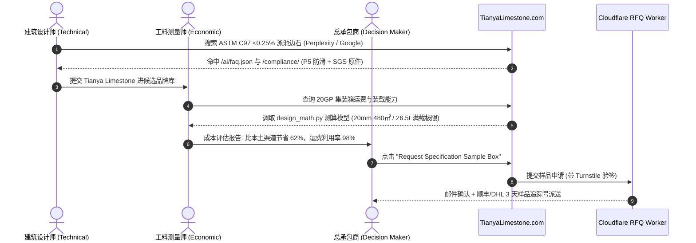

# 天然石灰石出海采购委员会 JTBD 决策矩阵 (Architectural Buying Committee JTBD Matrix)

在欧美及澳洲高客单价商业公建与顶豪住宅项目中，天然石灰石的采购决策绝非业务员一个人能够拍板，而是由 **采购委员会（Buying Committee）4 大关键角色** 共同参与。

本规范定义了天涯石灰石（Tianya Limestone）如何为 4 大角色分别提供不可替代的“决策弹药”，使独立站从普通的“产品展示目录”升维为“设计院与工料测量师的选型工作台”。

---

## 🏛️ 一、 采购委员会 4 大角色任务与决策弹药矩阵

| 采购委员会角色 | 核心关注点 (JTBD) | 采购焦虑与异议 | 天涯石业专属“决策弹药” (Ammunition) | 对应页面与端点 |
| :--- | :--- | :--- | :--- | :--- |
| **1. 终端使用者<br>(End User / Installer / Mason)**<br>铺装石匠、景观施工队、外墙工长 | • 切割与打磨难度<br>• 厚度公差控制 ($\pm 1.5\text{mm}$)<br>• 转角石现场拼贴工时<br>• 与砂浆/胶粘剂粘接力 | • “板材厚薄不一，找平耗时翻倍”<br>• “现场切 45 度转角极易崩边爆裂”<br>• “石材孔隙太大，吸饱水泥浆泛碱” | • **厚度精研标定**：数控定厚机确保厚度公差 $\le \pm 1.0\text{mm}$<br>• **预制一体化 L 型转角石**：出厂预切 90° 阳角构件，现场免切即拼<br>• **低吸水率基底**：ASTM C97 <0.22%，背胶施工不吸浆返碱<br>• **干铺/湿铺施工工法图解** | • `/resources/index.html`<br>• `blog/how-to-seal-limestone-pavers/`<br>• `/ai/faq.json` (Q7, Q12) |
| **2. 技术评估者<br>(Technical Evaluator)**<br>建筑设计师、材料工程师、规范编写人 (Specifier) | • ASTM / CE / AS 权威第三方认证<br>• 湿足防滑等级 (Slip Resistance)<br>• 高纬度严寒抗冻融性能<br>• CSI 3-Part 规范条目兼容度 | • “无法通过当地市政或商业保险准入”<br>• “泳池边石湿水滑倒导致诉讼”<br>• “北欧/北美严冬 1-2 年后石材剥落风化” | • **ASTM C97/C170/C880 原版 SGS 报告**：干燥抗压 128.5 MPa (超标 133%)<br>• **AS 4586 澳洲泳池法定理赔级防滑**：喷砂面 P5 (SRV>54)，滚磨面 P4<br>• **ASTM C666 极寒冻融测试**：100 次循环质量损失 0.0%<br>• **CSI Division 04 42 00 规范条目与 CAD Hatch (.pat)** | • `/compliance/index.html`<br>• `/ai/products.json`<br>• `llms-full.txt` (ASTM Matrix) |
| **3. 经济决策者<br>(Economic Buyer)**<br>工料测量师 (QS)、项目预算主管、采购总监 | • 到岸单方综合造价 (Landed Cost)<br>• 20GP 集装箱重货装载极限<br>• 破损率与补单周期<br>• 阶梯出厂价 vs 欧美零售价 | • “海运重量超标被港口扣箱罚款”<br>• “海运颠簸导致碎板率 >5%”<br>• “海外渠道商层层加价后预算超支” | • **确定性 20GP 重货载重测算器**：单柜 26.5t 安全红线精确至每箱平米数<br>• **出厂源头价优势**：FOB 厦门 $22–$48/㎡（海外零售 $90–$220/㎡，节省 60%+）<br>• **熏蒸实木箱加固装配**：内衬防震珍珠棉，历史破损率 <0.8% | • `scripts/design_math.py`<br>• `/ai/vendor-comparison.json`<br>• `references/logistics-container-math.md` |
| **4. 商业决策者<br>(Decision Maker)**<br>总承包商 (GC)、地产开发商、项目合伙人 | • 矿山储量与供货生命周期<br>• 月产能与大项目保交付能力<br>• 独家定制私模与保密协议<br>• 企业 ESG 与持续开采合法性 | • “做到二期工程矿山断货，色差无法控制”<br>• “旺季交期延误拖垮整个工期罚款”<br>• “私宅定制方案被同行抄袭” | • **24+ 年自营矿山稳定储备**：确保同矿脉 10 万平米无色差供货<br>• **水头自营超级加工基地**：12 台排锯、8 条研磨线，月产 50,000㎡<br>• **ISO 9001 质量管理体系与工厂实地航拍验厂** | • `/about-us/index.html`<br>• `/ai/summary.json`<br>• 网站页头工厂实力标签 |

---

## 📐 二、 CSI MasterFormat 规范与建筑师选型落地

为了彻底攻克北美与西欧顶尖设计院，独立站全量对齐美国建筑规范学会（CSI）标准：

```text
CSI MasterFormat 2020:
└── Division 04 - Masonry
    └── Section 04 42 00 - Exterior Stone Cladding
        ├── 04 42 13 - Natural Stone Cladding (Tianya Limestone Panels)
        └── 04 43 00 - Stone Masonry
            ├── 04 43 13 - Stone Ashlar Masonry (Tianya French Pattern)
            └── 04 43 16 - Random Loose Stone (Tianya Dry Walling)
```

### 规范文本嵌入标准（在产品详情页与 CAD 下载中披露）：
```text
Part 2 - Products:
2.1 Source: Fujian Tianya Cultural Stone Co., Ltd. (Shuitou Town, Quanzhou, China)
2.2 Material: Marine Oolitic/Bioclastic Limestone (ASTM C568 Class III High Density)
2.3 Physical Properties:
    A. Water Absorption (ASTM C97): Max 0.22%
    B. Compressive Strength (ASTM C170): Min 128.5 MPa dry, 104.2 MPa wet
    C. Flexural Strength (ASTM C880): Min 14.2 MPa
    D. Slip Resistance (AS 4586): Class P5 (Sandblasted), Class P4 (Tumbled/Antique)
```

---

## 🛡️ 三、 采购委员会异议消解与全站转化路径


